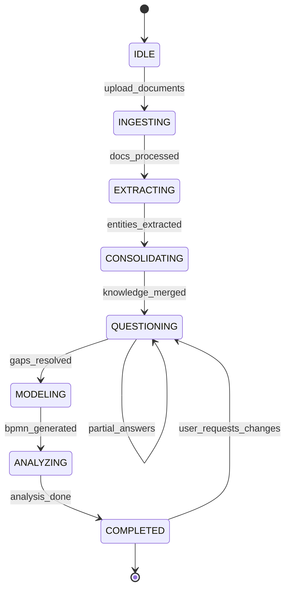

# Flujo del Agente IA — Pipeline de Análisis de Procesos

## Máquina de Estados del Agente



## Pipeline de 7 Fases

### Fase 1: INGESTA (INGESTING)

**Input:** Archivos del usuario (PDF, DOCX, XLSX, TXT, CSV, audio)

**Acciones:**
1. Validar tipo y tamaño de archivo
2. Almacenar en storage seguro
3. Extraer texto según tipo:
   - PDF → PyMuPDF + OCR fallback (Tesseract)
   - DOCX → python-docx
   - XLSX → openpyxl (hojas + celdas)
   - Audio → Whisper STT
4. Limpiar texto (headers, footers, ruido)
5. Detectar idioma
6. Chunking semántico (512 tokens, overlap 50)
7. Generar embeddings → ChromaDB

**Output:** Documentos indexados con metadata

---

### Fase 2: EXTRACCIÓN (EXTRACTING)

**Prompt del agente:** `prompts/extraction.txt`

**Entidades a extraer:**

| Entidad | Descripción | Ejemplo |
|---------|-------------|---------|
| activities | Actividades del proceso | "Revisar documentación" |
| participants | Personas mencionadas | "Juan Pérez - Operaciones" |
| areas | Áreas organizacionales | "Calidad", "TI" |
| systems | Sistemas/aplicaciones | "SAP", "SharePoint" |
| decisions | Puntos de decisión | "Si monto > $10K, requiere aprobación gerente" |
| inputs | Entradas del proceso | "Formulario solicitud" |
| outputs | Salidas del proceso | "Orden de compra" |
| business_rules | Reglas de negocio | "SLA 48 horas para respuesta" |
| problems | Problemas actuales | "Retraso en aprobaciones" |
| opportunities | Oportunidades mejora | "Automatizar validación documental" |
| exceptions | Flujos excepcionales | "Cuando proveedor no registrado" |
| documents | Documentos del proceso | "Acta de reunión", "Checklist calidad" |
| sequence | Secuencia lógica | A → B → C (gateway) → D |

**Output:** JSON estructurado por documento

---

### Fase 3: CONSOLIDACIÓN (CONSOLIDATING)

**Acciones:**
1. Merge de extracciones de múltiples documentos
2. Deduplicación semántica (similarity > 0.85)
3. Resolución de conflictos:
   - Misma actividad, diferente responsable → flag contradicción
   - Secuencias incompatibles → flag para pregunta
4. Construcción del modelo macro unificado
5. Identificación de subprocesos por área
6. Mapeo AS-IS inicial

**Prompt:** `prompts/consolidation.txt`

**Output:**
- `macro_model`: Vista general del proceso
- `area_models[]`: Modelos por área
- `contradictions[]`: Conflictos detectados
- `confidence_map`: Nivel de confianza por elemento

---

### Fase 4: GAP ANALYSIS + PREGUNTAS (QUESTIONING)

**Clasificación de preguntas:**

| Categoría | Propósito | Ejemplo |
|-----------|-----------|---------|
| `missing_info` | Completar flujo | "¿Qué ocurre después del rechazo?" |
| `business_rule` | Reglas de decisión | "¿Cuál es el monto máximo sin aprobación?" |
| `responsibility` | Roles y responsables | "¿Quién aprueba en ausencia del jefe?" |
| `system` | Integraciones | "¿Se registra en algún sistema?" |
| `exception` | Flujos alternos | "¿Qué pasa si el proveedor no existe?" |
| `kpi` | Indicadores | "¿Cuál es el tiempo promedio actual?" |
| `automation` | Oportunidades | "¿Se podría automatizar la validación?" |

**Estrategia de preguntas:**
1. Priorizar por impacto en diagrama BPMN (critical > high > medium > low)
2. Máximo 5 preguntas por ronda (no abrumar al usuario)
3. Contextualizar con cita del documento fuente
4. Adaptar según respuestas previas
5. Detener cuando completeness_score > 85%

**Prompt:** `prompts/questioning.txt`

---

### Fase 5: MODELADO BPMN (MODELING)

**Generación en 2 niveles:**

#### 5.1 Diagrama MACRO
- Pool principal del proceso
- Lanes por área/sistema
- Subprocesos colapsados
- Interacciones entre áreas
- Eventos inicio/fin
- Gateways principales
- Entradas/salidas anotadas

#### 5.2 Diagramas DETALLADOS
- Un diagrama por subproceso
- Actividades paso a paso
- Responsables en lanes
- Gateways con condiciones
- Flujos de excepción
- Documentos como data objects
- Sistemas como service tasks

**Prompt:** `prompts/bpmn_generation.txt`

**Validación BPMN:**
- Todo elemento conectado (no huérfanos)
- Un start event por proceso
- Al menos un end event
- Gateways con condiciones en flujos salientes
- Lanes con al menos una actividad

---

### Fase 6: ANÁLISIS DE MEJORA (ANALYZING)

#### AS-IS Analysis
```
- Flujo actual documentado
- Problemas (desde extracción + entrevistas)
- Cuellos de botella (actividades con mayor tiempo/espera)
- Desperdicios Lean (7 tipos)
- Riesgos ISO 31000
- Actividades manuales vs automatizadas
- Tiempos estimados por actividad
- Sistemas y gaps de integración
```

#### TO-BE Analysis
```
- Proceso optimizado
- Automatizaciones propuestas (RPA, API, IA)
- Eliminación de actividades innecesarias
- Nuevos controles y validaciones
- KPIs propuestos con metas
- Reducción de tiempos estimada
- Cambios organizacionales sugeridos
```

#### DMAIC Scoring
| Fase | Análisis |
|------|----------|
| Define | Alcance, cliente, CTQ |
| Measure | Tiempos, volúmenes, defectos |
| Analyze | Causas raíz, desperdicios |
| Improve | Soluciones propuestas |
| Control | KPIs, controles, monitoreo |

#### Madurez BPM (1-5)
1. Ad hoc → 2. Repetible → 3. Definido → 4. Gestionado → 5. Optimizado

**Prompt:** `prompts/analysis.txt`

---

### Fase 7: COMPLETADO (COMPLETED)

**Entregables generados:**
- Diagrama BPMN MACRO (.bpmn, .svg, .png)
- Diagramas DETALLADOS por subproceso
- Documento AS-IS / TO-BE
- Lista de recomendaciones priorizadas
- Dashboard con métricas
- Reporte de cumplimiento ISO
- Score de madurez BPM

---

## Arquitectura de Prompts

```
prompts/
├── system.txt              # Personalidad y reglas del agente
├── extraction.txt          # Extracción de entidades
├── consolidation.txt       # Merge multi-documento
├── questioning.txt         # Generación de preguntas
├── bpmn_generation.txt     # Generación modelo BPMN
├── bpmn_macro.txt          # Diagrama macro específico
├── bpmn_detailed.txt       # Diagrama detallado específico
├── analysis_as_is.txt      # Análisis estado actual
├── analysis_to_be.txt      # Análisis estado futuro
├── lean_waste.txt          # Detección desperdicios
├── iso_compliance.txt      # Evaluación ISO
└── dmaic.txt               # Análisis DMAIC
```

## RAG Strategy

```
Query del agente
    ↓
Embedding de la consulta
    ↓
Búsqueda semántica en ChromaDB (top_k=10)
    ↓
Filtro por project_id + document metadata
    ↓
Re-ranking por relevancia
    ↓
Contexto inyectado en prompt LLM
    ↓
Respuesta fundamentada en documentos
```

## Métricas de Calidad del Agente

| Métrica | Target |
|---------|--------|
| Completeness score | > 85% |
| Contradiction resolution | 100% flagged |
| BPMN validity | 100% elementos conectados |
| Question relevance | > 90% útiles (feedback usuario) |
| Extraction recall | > 80% actividades identificadas |
